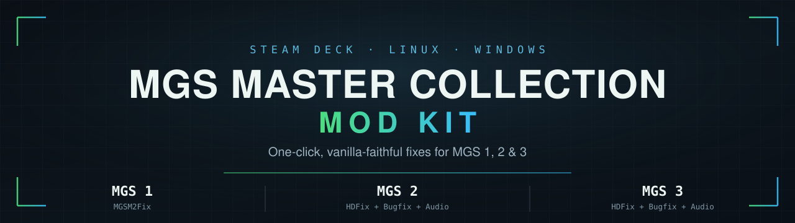

<div align="center">



<br><br>

[](https://github.com/cntrl-alt-lenny/mgs-mc-modkit/releases/latest)
[](https://github.com/cntrl-alt-lenny/mgs-mc-modkit/actions/workflows/ci.yml)


**The essential MGS 1 / 2 / 3 fixes, installed for you.**
Steam Deck · Linux · Windows — one double-click, nothing to configure, fully reversible

</div>

---

## ⚡ Quick start

<table>
<tr><td width="52" align="center"><h3>1</h3></td><td>
<b>Steam Deck / Linux:</b> put <a href="Install-MGS-Mods.desktop"><b><code>Install-MGS-Mods.desktop</code></b></a> on your Desktop, then <b>right-click → Properties → Permissions → tick "Is executable"</b>.
<br><sub>KDE blocks downloaded shortcuts until you do. 📦 It arrives as a cardboard box — naturally; the first run swaps in the kit's own  version.</sub>
<br><br><b>Windows:</b> put <a href="Install-MGS-Mods.cmd"><b><code>Install-MGS-Mods.cmd</code></b></a> anywhere and double-click it. Needs <a href="https://www.python.org/downloads/">Python</a> (free — tick <i>"Add python.exe to PATH"</i>); the shortcut opens that page for you if it's missing.
<br><sub>If Windows shows a blue "protected your PC" note: <i>More info → Run anyway</i> — it appears for any downloaded script.</sub>
<br><br><sub>🔒 Either shortcut only runs an installer whose SHA-256 matches a pinned GitHub release.</sub>
</td></tr>

<tr><td align="center"><h3>2</h3></td><td>
<i>Optional but recommended:</i> grab the <b>Better Audio</b> files from NexusMods (free login). Keep them anywhere — you'll point at them in step 3, and renaming is fine.
<br><br>
🔊 <a href="https://www.nexusmods.com/metalgearsolid2mc/mods/3"><b>MGS2</b></a> — <i>Full Version</i> &nbsp;·&nbsp; 🔊 <a href="https://www.nexusmods.com/metalgearsolid3mc/mods/4"><b>MGS3</b></a> — <i>main file</i> + <i>Update 2.0</i> <sub>(+ optional <i>HQ Ending Cutscenes</i>)</sub>
</td></tr>

<tr><td align="center"><h3>3</h3></td><td>
<b>Double-click the shortcut.</b> Tick which audio files you want, pick them, press <b>Install now</b>. That's it.
<br><sub>Everything else is preset. <i>Change settings…</i> is there if you want different button prompts, 5.1 sound, or the KONAMI logos back.</sub>
</td></tr>

<tr><td align="center"><h3>4</h3></td><td>
<b>Steam Deck / Linux only:</b> in Steam, right-click <b>each</b> game → <i>Properties → Launch Options</i> and paste its line:
<br><br>
<b>MGS2 &amp; MGS3</b> &nbsp;<code>WINEDLLOVERRIDES="wininet,winhttp=n,b" %command%</code><br>
<b>MGS1</b> &nbsp;<code>WINEDLLOVERRIDES="dinput8=n,b;d3d11=n,b" %command%</code>
<br><br><sub>The installer offers a <b>Copy to clipboard</b> button for each line and saves them to <code>MGS Steam Launch Options.txt</code> on your Desktop. <b>Without this the mods don't load.</b></sub>
<br><br><b>Windows:</b> nothing to do — the mods load by themselves. Just play. 🎉
</td></tr>
</table>

> **Step 4 is the only manual bit, and only on Steam Deck / Linux** (Proton
> needs launch options, and Steam overwrites config changes made while it's
> running, so no script can set them reliably).

---

## 📦 What you get

| Game | Mods installed | Result |
|:--|:--|:--|
| **MGS1** | [MGSM2Fix](https://github.com/nuggslet/MGSM2Fix) `3.6.0` | Analog deadzone gone, uncensored Western textures restored, startup notices skipped, high internal resolution |
| **MGS2** | [MGSHDFix](https://github.com/ShizCalev/MGSHDFix) `3.1.0` + [Bugfix Compilation](https://github.com/ShizCalev/MGS2-Community-Bugfix-Compilation) `2.2.0` + *audio* | True 16:10, correct FOV, lower CPU, PS2 textures & models back, launcher skipped, HQ cutscenes, uncompressed audio — plus a fix for a late-game cutscene crash |
| **MGS3** | [MGSHDFix](https://github.com/ShizCalev/MGSHDFix) `3.1.0` + [Bugfix Compilation](https://github.com/ShizCalev/MGS3-Community-Bugfix-Compilation) `1.1.0` + *audio* | As MGS2: true 16:10, correct FOV, lower CPU, restored assets, launcher skipped, uncompressed audio |

Mods install in the order their authors require, straight from their official
releases — **nothing is rehosted here**.

> 🌿 **Vanilla-faithful only.** Every mod is a *fix* or a *restoration*.
> AI-upscaled texture packs are deliberately excluded.

---

## 🔒 Safe by design

|  |  |
|:--|:--|
| **Verified downloads** | Every auto-downloaded file must match a pinned SHA-256 before it's used |
| **Nothing half-done** | Files are unpacked and path-checked in a staging area first; a failure puts the game back as it was |
| **Crash-safe** | Backups are never overwritten, and a power cut mid-install can't make the next run mistake mod files for your originals |
| **Won't fill your drive** | Free space is checked against each file's real unpacked size first |
| **Repair & remove built in** | Run the shortcut again: *install/repair* or *remove the mods*. It remembers your settings |
| **Tested** | [134 automated tests](tests/) in [CI](.github/workflows/ci.yml) — bad archives, interrupted installs, partial re-installs, uninstall |

<sub>One honest caveat: Better Audio replaces some multi-GB game files that are
too large to back up. Those specific files come back via Steam's <i>Verify
integrity</i>; everything else the kit does is fully reversible.</sub>

---

<details>
<summary><b>🔊 The audio files, and why you fetch them yourself</b></summary>

<br>

Better Audio restores the higher-quality sound this port re-compressed. For MGS2
it **also replaces a corrupted file that can crash a late-game cutscene**, which
is why it's strongly recommended.

It lives on NexusMods, which needs a free login, and **its author does not permit
it being hosted anywhere else** — so this kit will never mirror it or download it
for you. (The files are also 2–3 GB, over GitHub's release size limit.)

**What to download**

| Component | Nexus file | Notes |
|:--|:--|:--|
| MGS2 audio | *Full Version* | The only MGS2 file |
| MGS3 audio | the *main file* (v1.0) | v1.0 **is** current |
| MGS3 audio update | *Update 2.0* (~25 MB) | Recommended, but optional |
| MGS3 HQ ending | *HQ Ending Cutscenes* | Optional, **off** by default |

Each is a separate tickbox and installs independently — so you can add the update
later, or install just it if you already have the main file. When several are
chosen the order is enforced (main → ending → update).

**Files can live anywhere and be renamed.** The installer identifies each one by
what's *inside* it, checked against the real archives: MGS2's payload contains
folders MGS3's never does, and a full pack is thousands of files where the
patches are two or three. If a file can't be identified it asks rather than
guessing, and it refuses one belonging to the other game.

> ⚠️ *HQ Ending Cutscenes* has one quirk from its author: the final two
> cutscenes **pause at the end and need a button press** to continue. Hence off
> by default.

</details>

<details>
<summary><b>🎚️ Settings and their defaults</b></summary>

<br>

These aren't asked one at a time — the review screen shows them and you press
**Install now**. Everything is behind *Change settings…* if you want otherwise,
and your choices are remembered next time.

| Setting | Default |
|:--|:--|
| Button prompts | Auto-detected — `Steam Deck` on a Deck, `Xbox` elsewhere. PS5, PS2 and keyboard also offered |
| Sound | `Stereo` — correct for handheld, headphones and TV. Pick 5.1 only with real surround speakers |
| High-quality cutscenes | on |
| Skip KONAMI intro logos | on |
| Boot straight into the games | on |

There is deliberately **no** "check for mod updates" option: the mod versions
here are matched to the settings file the kit writes, so a mod updating itself
can stop the games launching. Updates reach you through new releases of this kit.

> 🚫 **No MGS3 high-res texture option.** Konami's official texture pack can be
> installed on a Steam Deck but **cannot be used in-game** there, so the kit
> keeps its flag off. (The Bugfix Compilation's restored textures are unrelated
> and always installed.)
>
> 🖥️ **On a TV and it looks soft?** SteamOS may default to 720p — set
> *Properties → Game Resolution* to **Native**.
>
> 🌍 **Another language?** The kit writes English defaults. Run
> `MGSHDFix Config Tool.exe` in the game's `plugins/` folder once to change it.

</details>

<details>
<summary><b>🕹️ MGS1: what to pick on first boot</b></summary>

<br>

MGS1's version-select menu appears **once**, then it boots straight in (change
versions later from the in-game pause menu).

| Setting | Pick | Why |
|:--|:--|:--|
| Version | **METAL GEAR SOLID (US)** | Full-speed 60 Hz English. The EU disc is 50 Hz PAL — genuinely ~17% slower, with borders |
| Resolution | **Max** | M2's official internal upscale: sharp and era-authentic |
| Screen size | Original / 4:3 | Correct framing. Never the stretch option |
| Smoothing | Off | PS1 hardware had no texture filtering — off is authentic. Taste, though |

MGSM2Fix's own defaults (which the kit keeps) already revert the Master
Collection's censored textures, remove the analog deadzone, and skip the startup
notices.

</details>

<details>
<summary><b>🧹 Repair, remove & troubleshooting</b></summary>

<br>

**Just double-click the shortcut again.** It notices the games are already set up
and asks what you want:

- **Install or repair mods** — re-applies everything; also how you add audio later
- **Remove the mods** — full uninstall
- **Quit**

> 🔑 **Keep the shortcut** — it's your repair and uninstall button, not just an
> installer.

Uninstall reverses what the kit recorded: removes the files it added, restores
the originals it backed up, and clears the obsolete legacy `MGSM2Fix.asi` that
upstream warns can clash with current releases. **Your saves are never touched.**
If something can't be reverted, the backups are *kept* so you can retry.

<sub>Terminal alternative: <code>python3 install.py --uninstall</code></sub>

**Removing it by hand instead:** Steam → *Properties → Installed Files → Verify
integrity*, then delete — MGS2/3: `winhttp.dll`, `wininet.dll`, `plugins/`,
`mgs-modkit/`, `logs/`, `steam_appid.txt` · MGS1: `d3d11.dll`, `dinput8.dll`,
`MGSM2Fix*.asi`, `MGSM2Fix.ini`, `mgs-modkit/`.
*Verify integrity restores original files but does **not** delete added ones.*

| Problem | Fix |
|:--|:--|
| Mods don't load at all | The launch options aren't set — see step 4 |
| *"Failed to read config key…"* | Run `MGSHDFix Config Tool.exe` in `plugins/` → *Save and Exit* |
| Want the Konami launcher back | `plugins/MGSHDFix.settings` → `Skip Launcher=0` |
| `No display-attached GPUs were detected` | Harmless on Deck/Proton, appears every run |

</details>

<details>
<summary><b>🔍 Why this kit exists</b></summary>

<br>

**MGSHDFix has no built-in defaults.** Without a complete `MGSHDFix.settings` it
refuses to launch, and it aborts on any *single* missing key:

```
[MGSHDFix Config Helper] Failed to read config key 'Debug Logging'
in section 'Internal Settings': Section not found
```

That file can normally only be produced by the mod's **Windows-only Config
Tool**, and its section names aren't the tab labels that tool shows you — so
hand-writing one doesn't work either. This kit ships a canonical settings file
captured from the real tool.

**The launcher is the other trap.** It's the only place to enable *high quality
cinematics*, so skipping it normally locks you out of that setting. The kit
writes the launcher's own save directly, so you get both.

**Versions are pinned deliberately** — the bundled settings file is matched to
MGSHDFix `3.1.0`, and a future release could rename sections and break launching.

</details>

<details>
<summary><b>🛠️ For maintainers</b></summary>

<br>

Run the tests: `pip install pytest && python3 -m pytest tests/` (needs `bsdtar`).
Check the pinned mod versions and hashes: `python3 tools/refresh_checksums.py`.

Both shortcuts (`.desktop` for Linux, `.cmd` for Windows) pin release
**`v2.0.0`**. To cut a release, push a matching tag —
[`release.yml`](.github/workflows/release.yml) runs the tests (Linux **and**
Windows), **fails if either shortcut's embedded tag/SHA-256 doesn't match
`install.py`**, then publishes. After editing `install.py`: update `TAG=`/`SHA=`
in BOTH shortcuts (`sha256sum install.py`), bump `MODKIT_VERSION`, then tag.

**Deliberately excluded:** AI-upscaled texture addons (upstream's own README
calls them AI upscales), MGS3 Crouch Walk (adds a mechanic), MGSHDFix nightlies
(unpinnable, and settings-schema drift is exactly what breaks launching),
Konami's HD texture pack (unusable in-game on Deck), and the MGS3 4K assets
addon (pointless at 800p).

</details>

---

<div align="center">

### 🙏 Credits

The real work belongs to **[ShizCalev](https://github.com/ShizCalev)**,
**[Lyall](https://github.com/Lyall)**, **[nuggslet](https://github.com/nuggslet)**
and **knight_killer**.
<br>This kit only automates installing it — please endorse and star their work.

<br>

**MIT** · [LICENSE](LICENSE) · Runs on stock SteamOS (`python3`, `bsdtar`, `kdialog`) and stock Windows 10/11 (+ free [Python](https://www.python.org/downloads/))

</div>
