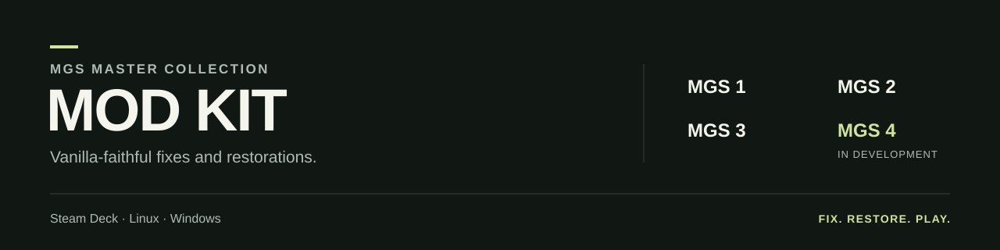

<div align="center">



<br><br>

[](https://github.com/cntrl-alt-lenny/mgs-mc-modkit/releases/latest)
[](https://github.com/cntrl-alt-lenny/mgs-mc-modkit/actions/workflows/ci.yml)


**The essential MGS 1 / 2 / 3 fixes, installed for you.**

Steam Deck · Linux · Windows — vanilla-faithful fixes and restorations.

</div>

## Install

1. Install MGS1, MGS2 and/or MGS3 through Steam. Close the games and finish Steam downloads.
2. Download the shortcut from the [latest release](https://github.com/cntrl-alt-lenny/mgs-mc-modkit/releases/latest): **Windows:** `Install-MGS-Mods.cmd` (requires [Python 3](https://www.python.org/downloads/)); **Deck/Linux:** `Install-MGS-Mods.desktop` (put it on your Desktop and enable **Properties → Permissions → Is executable**).
3. Run it, choose your games and optional audio files, review the settings, then select **Install now**. Internet access and sufficient staging/backup space are required.
4. **Deck/Linux:** paste each game's line into Steam → **Properties → Launch Options**:

```text
MGS1:        WINEDLLOVERRIDES="dinput8=n,b;d3d11=n,b" %command%
MGS2 & MGS3: WINEDLLOVERRIDES="wininet,winhttp=n,b" %command%
```

The installer saves these lines on your Desktop and offers clipboard copying. Windows needs no launch options. Keep the shortcut for repairs and removal; each release downloads a fixed installer and verifies its SHA-256.

## What you get

| Game | Pinned mods | Result |
|:--|:--|:--|
| MGS1 | [MGSM2Fix](https://github.com/nuggslet/MGSM2Fix) 3.6.0 | Resolution, texture restoration and analog fixes |
| MGS2 | [MGSHDFix](https://github.com/ShizCalev/MGSHDFix) 4.1.0 + [Bugfix](https://github.com/ShizCalev/MGS2-Community-Bugfix-Compilation) 3.0.0 | Aspect ratio, CPU, visual and asset fixes |
| MGS3 | MGSHDFix 4.1.0 + [Bugfix](https://github.com/ShizCalev/MGS3-Community-Bugfix-Compilation) 2.0.1 | Aspect ratio, CPU, visual and asset fixes |

Mods come from their authors' official releases. AI-upscaled textures and gameplay changes are excluded. MGS1's first boot: choose **US**, **Max**, **4:3**, **Smoothing Off**.

## Settings and optional audio

Defaults are stereo, HQ cutscenes, skipped logos and launcher skipping; button prompts match Deck/Xbox. **Change settings…** applies selected options across your selection. Repairs preserve valid custom settings independently for each game. **Reset to recommended settings** is a separate choice. See [settings](docs/SETTINGS.md).

Better Audio requires downloading the author's Nexus files yourself. Components are optional and independently selectable; MGS3 HQ ending scenes can require a button press. See [audio downloads and supported layouts](docs/AUDIO.md).

## Repair, remove and recover

Run the shortcut again and choose **Install or repair mods** or **Remove the mods**. Failed or cancelled installs restore pre-run snapshots; an interrupted run recovers when you rerun it. Each game commits independently, and failures list every game's result. Game progress saves are preserved; launcher preferences are managed separately.

Permanent backups exclude originals over 64 MiB. Removal tells you when Steam **Verify integrity** is required, then you rerun removal to finish. Missing or damaged records need attention: keep the recovery folder and follow [troubleshooting](docs/TROUBLESHOOTING.md). Session logs include paths and detailed errors.

## Maintainers and credits

Read [upgrading](docs/UPGRADING.md), the [upgrade assessment](docs/UPGRADE_ASSESSMENT.md), and [releasing](docs/RELEASING.md). Releases require Linux and Windows checks on the tagged commit.

Thanks to ShizCalev, Lyall, nuggslet, Afevis and knight_killer. Please endorse their work. **MIT** · [LICENSE](LICENSE)
